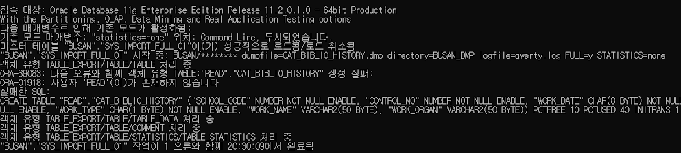
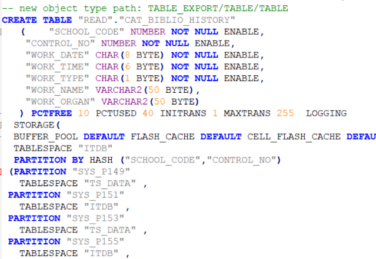
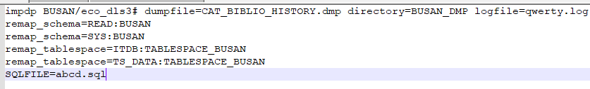
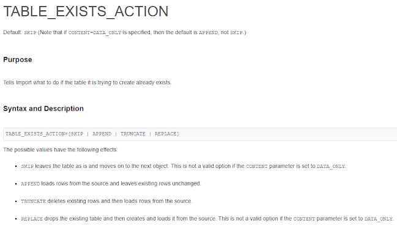

여러가지 일을 하다보면 타 부서와 협업하거나, 부서내 다른 사람이 작업한 것을 뒤이어서 작업하게 되는 경우가 종종 발생한다.

그런 종류의 다양한 업무가 있겠지만, 이번에는 오라클 덤프파일만 받았을 때 생긴 일에 대해서 적어본다.

오라클 데이터베이스를 통째로, 또는 일부 테이블만 export하여 다른 DB로 옮길 수 있다.

하지만 이 때 DMP파일만 있다고 해서 쉽고 편안하게 넣을 수 있는 것 만은 아니다.

DMP파일을 추출하게 되면 원본 DB의 스키마(테이블스페이스, 계정명 등)이 함께 딸려나오는데, 그런 것들을 모르고 DMP파일만을 가지고 있으면 원본DB의 스키마와 목적DB의 스키마가 일치하지 않아서 온갖 에러를 내뿜고 실패하는 경우가 발생하게 된다.

내가 받은 DMP파일은 테이블단위로 export한 덤프파일인데, 원본DB의 테이블스페이스와 계정명을 모르는 상태였다. 스키마를 몰라도 일단 expdp를 명령어를 사용하여 export했다는 흔적이 보여서 일단 무작정 impdp로 import를 시도해봤다.


```
impdp qwerty/abcd dumpfile=CAT_BIBLIO_HISTORY.dmp directory=BUSAN_DMP logfile=qwerty.log FULL=y STATISTICS=none
```

  

오류메시지의 내용을 봤을때, 원본 DB의 USER_NAME은 "READ"인 것 같다. 이렇게 대충 계정명을 알아낼 수는 있지만, 이 것을 어찌어찌 해결해도 다른 스키마에서 문제가 생길 것은 분명하다.
그래서 아래와 같은 명령어를 다시 작성했다.

```
impdp qwerty/abcd dumpfile=CAT_BIBLIO_HISTORY.dmp directory=BUSAN_DMP logfile=qwerty.log FULL=y STATISTICS=none SQLFILE=abcd.sql
```

중요한 부분은 SQLFILE=abcd.sql이다. SQLFILE옵션을 주게되면 impdp명령어를 수행하지 않고, impdp를 수행했을때 DB에 입력되는 쿼리문을 sql파일로 고대로 출력해준다.

>https://docs.oracle.com/cd/B19306_01/server.102/b14215/dp_import.htm

  

그렇게 생성된 sql파일을 보면 위와같이 원본DB는 "READ"라는 계정명과 TS_DATA, ITDB라는 테이블스페이스를 사용했다는 것을 알 수 있다.

그러므로 위의 쿼리 내용에서 계정명과 테이블스페이스만 목적지DB에 맞게 수정하면 된다.

  

--------------------------------------------------------------------------------------------------

2022.05.13 추가

`TRANSFORM=SEGMENT_ATTRIBUTES:N`

위 옵션을 넣으면 DMP파일 내의 TABLESPACE를 무시하고 들여오는 계정의 DEFAULT_TABLESPACE로 자동 import 된다.

>https://docs.oracle.com/database/121/SUTIL/GUID-64FB67BD-EB67-4F50-A4D2-5D34518E6BDB.htm#SUTIL939

-------------------------------------------------------------------------------------------------

2023.02.02 추가

깡통 상태에서 임포트 명령어 한 번으로 모든게 잘 되면 좋겠지만 이런 작업들은 대개 자잘한 오류가 발생하기 마련이다. 그런 문제가 생겼을때 import user를 삭제하고 다시 만드는 등, 깔끔하게 정리 한 다음에 다시 시도하는 것이 좋으나, 덤프파일의 용량이 크면 한 번 작업하는 데에 시간이 오래 걸리기 때문에 시간상의 이유로 이전에 작업한 내용을 덮어쓰거나 이어서 작업해야 하는 경우가 있다. 그럴 때에는 table_exist_action옵션을 사용하면 된다.
```sql
impdp qwerty/abcd
dumpfile=dump_%U.dmp                     
table_exists_action=replace 
logfile=log_file_name_here.log                     
STATISTICS=none
directory=aaaa
TRANSFORM=SEGMENT_ATTRIBUTES:N
remap_schema=bbbb:cccc
```

  

>https://docs.oracle.com/database/121/SUTIL/GUID-C9664F8C-19C5-4177-AC20-5682AEABA07F.htm#SUTIL936

덤프파일 용량이 커서 파일이 분할되어 있다면 `_%U`옵션을 써서 여러개의 파일을 로딩할 수 있다.
